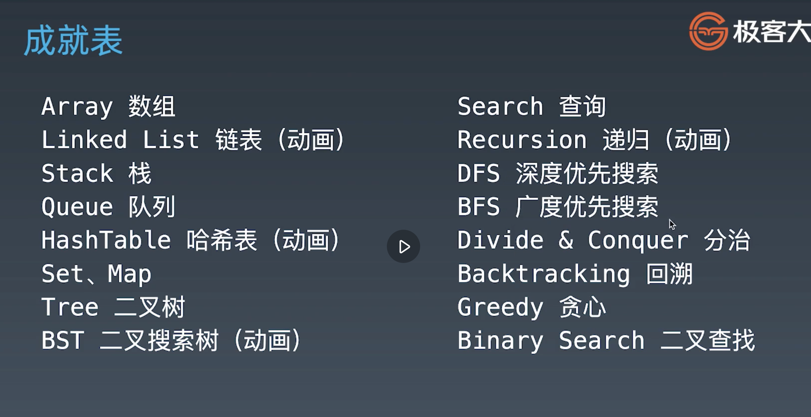

# algorithm

## four steps

## visual algorithm

[visual algorithm](https://visualgo.net) 

## no idea

## list

## book

[Introduction to Algorithms](img/Introduction_to_Algorithms_Third_Edition_(2009).pdf)

## what is the point of saying "non decreasing order" instead of "increasing order"?

Non decreasing order and increasing order are not the same cause, in non decreasing order, there can be two continuous number in an array where a<=b, but if we say the array is in strictly increasing order means then a<b. Let us see an example, [0,0,1,1,1,2,3] it is in non-decreasing order, whereas [1,2,3,4,5] is in increasing order.

https://leetcode.com/problems/remove-duplicates-from-sorted-array/solutions/2601915/remove-duplicates-from-sorted-array/?orderBy=most_votes  
