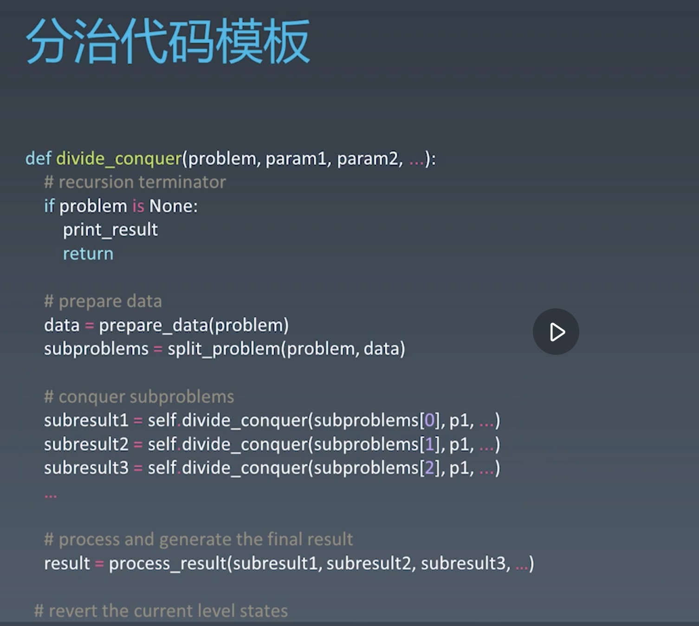

# divide and conque

## time complexity

O(NlogN)

## code template

## use cases

The divide-and-conquer technique is the basis of efficient algorithms for many problems, such as sorting (e.g., quicksort, merge sort).

