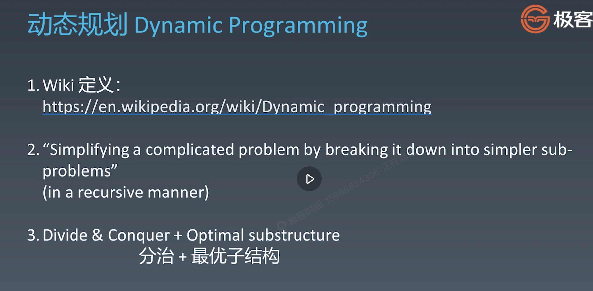

# Dynamic programming

## definiation

## two key attributes

There are two key attributes that a problem must have in order for dynamic programming to be applicable: optimal substructure and overlapping sub-problems. If a problem can be solved by combining optimal solutions to non-overlapping sub-problems, the strategy is called "divide and conquer" instead.[1] This is why merge sort and quick sort are not classified as dynamic programming problems.

## two approaches

This can be achieved in either of two ways:

**Top-down approach**: This is the direct fall-out of the recursive formulation of any problem. If the solution to any problem can be formulated recursively using the solution to its sub-problems, and if its sub-problems are overlapping, then one can easily memoize or store the solutions to the sub-problems in a table. Whenever we attempt to solve a new sub-problem, we first check the table to see if it is already solved. If a solution has been recorded, we can use it directly, otherwise we solve the sub-problem and add its solution to the table.

**Bottom-up approach**: Once we formulate the solution to a problem recursively as in terms of its sub-problems, we can try reformulating the problem in a bottom-up fashion: try solving the sub-problems first and use their solutions to build-on and arrive at solutions to bigger sub-problems. This is also usually done in a tabular form by iteratively generating solutions to bigger and bigger sub-problems by using the solutions to small sub-problems. For example, if we already know the values of F41 and F40, we can directly calculate the value of F42.

https://en.wikipedia.org/wiki/Dynamic_programming#Computer_programming  

## dp vs recrusion and divide and conque

## Fibonacci Numbers

### recursion 

### recursion + memory(unoptimized and optimized)

### dp(bottom up)

https://github.com/TheAlgorithms/Java/blob/master/src/main/java/com/thealgorithms/dynamicprogramming/Fibonacci.java  

## How to initialize first row and column? 

1. It can be easy to assign 0 or 1 like unique path and for do some calculation like unique path 2. 

1.1 For unique path, there is only one path to reach the cells in the first row: right->right->...->right. The same is valid for the first column, though the path here is down->down-> ...->down.

        for ($i = 0; $i < $m; $i++) {
            $dp[$i][0] = 1;
        }
        for ($i = 0; $i < $n; $i++) {
            $dp[0][$i] = 1;
        }

1.2 For unique path2, there are obstacles. If any cell has an obstacle, we won't let that cell contribute to any path.As the reboot is put in the first cel, so $dp[0][0] = 1;

        $dp[0][0] = 1;
        //$dp[$i-1][0] == 1 or $dp[0][$j-1] == 1 use $dp to check if last row or column has stone
        for ($i = 1; $i < $m; $i++) {
            $dp[$i][0] = $obstacleGrid[$i][0] == 0 && $dp[$i-1][0] == 1 ? 1 : 0;
        }

        for ($j = 1; $j < $n; $j++) {
            $dp[0][$j] = ($obstacleGrid[0][$j] == 0 && $dp[0][$j-1] == 1) ? 1 : 0;
        }

https://leetcode.com/problems/unique-paths/solutions/504514/unique-paths/?orderBy=most_votes
https://leetcode.com/problems/unique-paths-ii/solutions/184772/unique-paths-ii/?orderBy=most_votes

2. Another is to add an extra row and column on $dp because the initial first element needs to use the same logic as other elements, so $dp adds one more element and initializes all to 0. $text1[1] and $text2[1] is based on $dp[0], in iterate, $dp[i] relates $text[i-1]. The example is long common sequence.

    //$dp length is $m+1,$n+1, $text1 and $text 2 length is $m, $n
    //so $dp is from 0 to $m+1, $n+1, the last element $dp[$m][$n]
    //because the length is different, $dp[$i][$j] relates $text1[$i-1] and $text2[$j-1]
    $dp = [];
    //initialize also need $i < $m + 1, not $i < $n
    for ($i = 0; $i < $m + 1; $i++) {
        $dp[$m][0] = 0;
    }
    for ($i = 0; $i < $n + 1; $i++) {
        $dp[0][$n] = 0;
    }
    for ($i = 1; $i < $m + 1; $i++) {
        for ($j = 1; $j < $n + 1; $j++) {
            if ($text1[$i-1] != $text2[$j-1]) {
                $dp[$i][$j] = max($dp[$i-1][$j], $dp[$i][$j-1]);
            } else {
                $dp[$i][$j] = $dp[$i-1][$j-1] + 1;
            }
        }
    }
    return $dp[$m][$n];
    
https://leetcode.com/problems/longest-common-subsequence
https://leetcode.com/problems/longest-common-subsequence/submissions/890580919/
https://leetcode.com/problems/longest-common-subsequence/solutions/348884/c-with-picture-o-nm/?orderBy=most_votes

        
