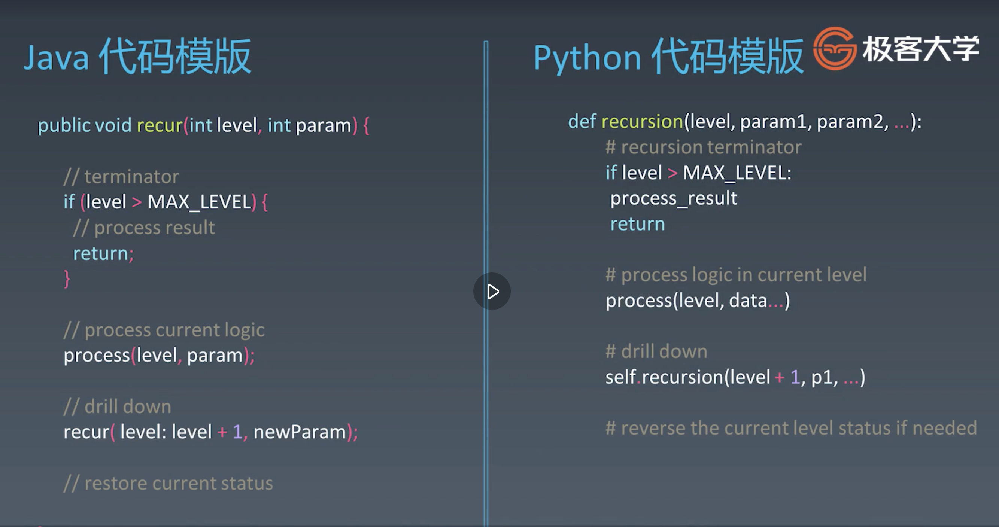

# Recursion

## recursion application (Fibonacci numbers)

1. divided by and conque, including mergesort and quicksort.
2. dynamic programming (coin change)
3. backtracking (tic-tac-toe)
4. numerical application like RSA encryption 

## code template

